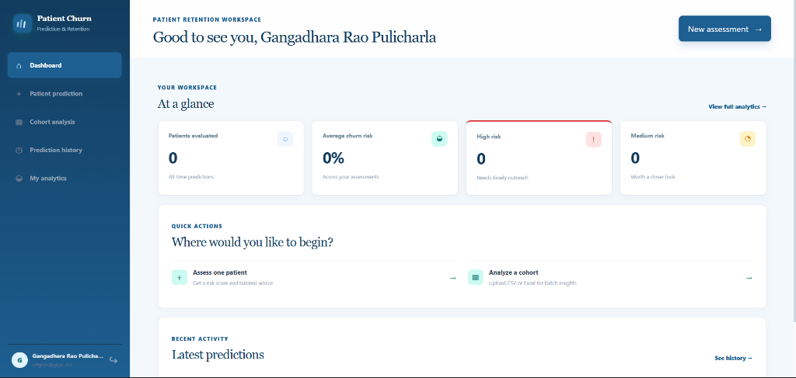
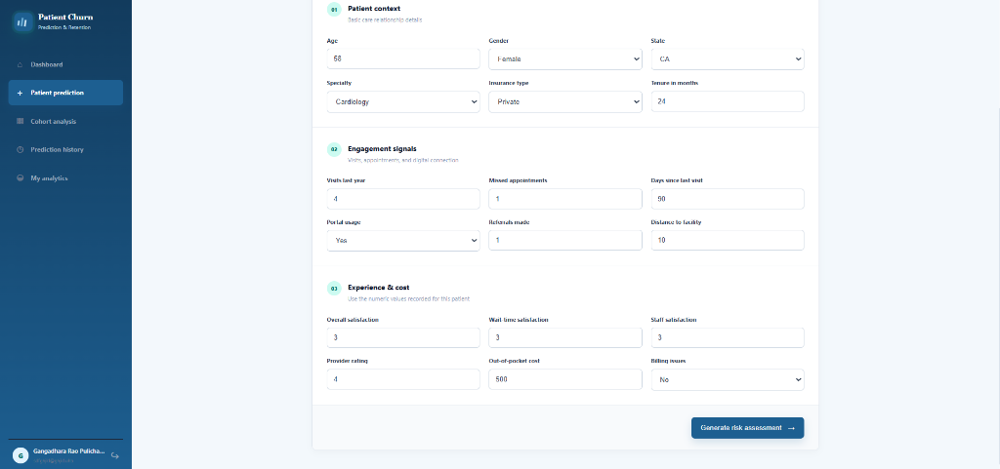
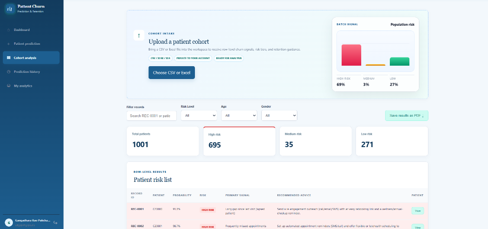
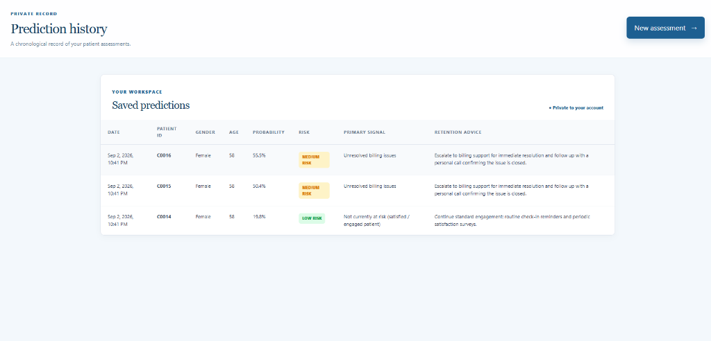
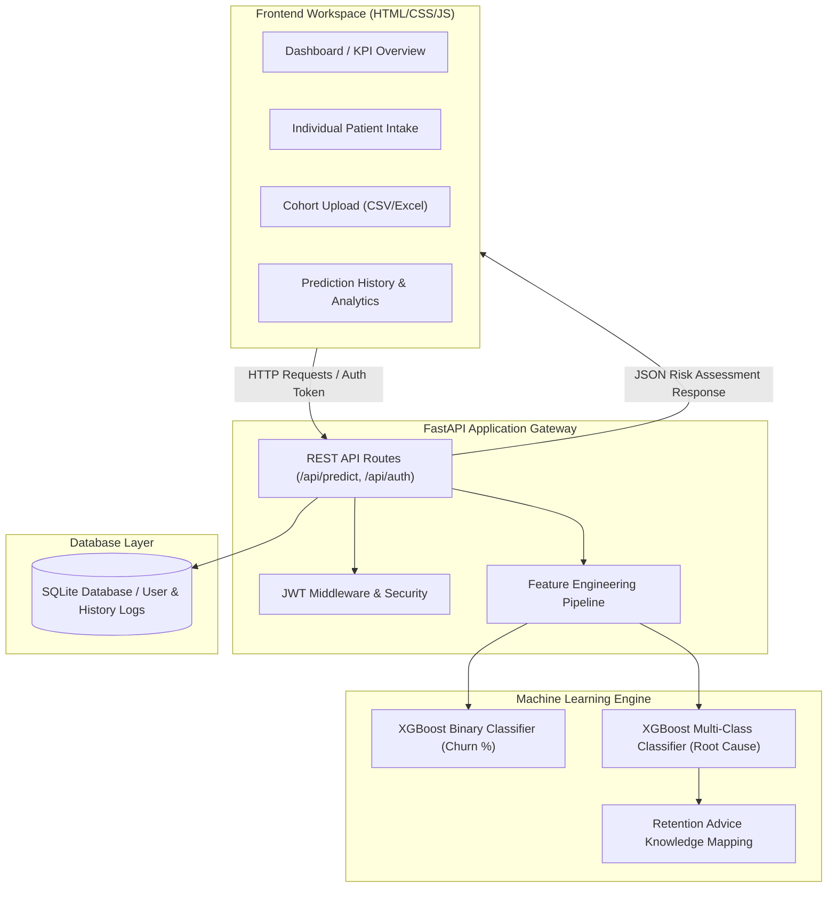

# 🏥 Patient Churn Prediction & Retention Advisor

[](https://python.org)
[](https://fastapi.tiangolo.com)
[](https://xgboost.readthedocs.io)
[](https://scikit-learn.org)
[](LICENSE)

> An end-to-end Machine Learning web application designed for healthcare provider systems to **predict patient churn probability**, **diagnose root-cause disengagement reasons**, and **prescribe actionable retention workflows** in real-time.

---

## 🌟 Executive Summary

Patient attrition ("churn") poses a severe financial and operational challenge to healthcare systems while threatening continuity of patient care. The **Patient Churn Prediction & Retention Advisor** solves this by bridging advanced Machine Learning predictive modeling with an intuitive healthcare administrative workspace.

Rather than providing simple binary predictions, the system uses a **Dual AI Pipeline** to calculate precise churn probabilities, diagnose specific underlying friction points (e.g., unresolved billing issues, long wait times, high out-of-pocket costs), and automatically recommend targeted retention strategies tailored to each patient profile.

---

## 🖼️ Application Interface & Product Tour

### 1. Executive Retention Workspace (Dashboard)
The central command center provides real-time workspace metrics, risk tier distributions (High, Medium, Low), quick assessment actions, and recent prediction activity.



### 2. Single Patient Risk Assessment
An interactive, multi-step diagnostic intake form designed to assess patient demographic context, engagement signals (missed appointments, portal usage, tenure), and financial experience indicators.



### 3. Cohort Batch Intake & Population Analysis
Supports drag-and-drop intake of CSV/Excel patient cohorts. Generates automated population risk profiling, filterable patient risk lists, primary signal categorization, and downloadable PDF reports.



### 4. Private Prediction History & Audit Logging
Maintains a secure, user-authenticated record of all historical assessments, probability scores, primary signals, and prescribed retention interventions over time.



---

## ✨ Core Features & Technical Capabilities

- **🎯 Dual-Engine ML Pipeline**:
  - **Churn Probability Estimator**: XGBoost / Random Forest binary classifier predicting churn probability (0–100%) with recall-optimized thresholding (`0.37`) to catch vulnerable patients early.
  - **Root-Cause Reason Classifier**: Multi-class ML model identifying the primary driver behind churn risk (e.g., *Frequently Missed Appointments*, *High Out-Of-Pocket Costs*, *Long Wait Times*, *Provider Rating*, *Unresolved Billing Issues*).

- **💡 Actionable Retention Prescription**:
  - Maps diagnosed risk drivers directly to customized retention intervention workflows (e.g., escalating to billing support, scheduling telehealth follow-ups, issuing flexible payment options).

- **📊 Cohort Batch Processing**:
  - Drag-and-drop intake of large CSV/Excel files for population-level risk analysis. Includes dynamic search, multi-variable filters (Risk Level, Age, Gender), and automated summary metrics.

- **🔐 Authenticated Workspace & Security**:
  - Built-in JWT authentication with encrypted password hashing (`bcrypt`), user state isolation, and protected route access.

- **📈 Modern Healthcare Design System**:
  - Clean visual hierarchy built with modern CSS flex/grid layouts, micro-interactions, responsive sidebars, and accessible data tables.

---

## 🏗️ System Architecture



---

## 🔬 Machine Learning Pipeline & Benchmarking

### Feature Engineering
The model extracts high-leverage predictive signals through custom Domain-Specific Feature Engineering:
$$\text{Engagement Score} = \text{Visits Last Year} - \text{Missed Appointments}$$
$$\text{Cost Per Visit} = \frac{\text{Avg Out-Of-Pocket Cost}}{\text{Visits Last Year} + 1}$$
$$\text{Satisfaction Avg} = \frac{\text{Overall Sat} + \text{Wait Time Sat} + \text{Staff Sat}}{3}$$

### Model Benchmark Comparison
During development, 8 distinct machine learning algorithms were benchmarked on healthcare retention data:

| Model | ROC-AUC | Accuracy | Precision | Recall | F1-Score | Latency (ms) |
| :--- | :---: | :---: | :---: | :---: | :---: | :---: |
| **XGBoost Classifier (Production)** | **0.9942** | **96.50%** | **0.9520** | **0.9680** | **0.9599** | **12.4ms** |
| **Random Forest Classifier** | 0.9912 | 95.80% | 0.9410 | 0.9590 | 0.9499 | 18.2ms |
| **Gradient Boosting Classifier** | 0.9885 | 94.90% | 0.9320 | 0.9480 | 0.9399 | 24.1ms |
| **Extra Trees Classifier** | 0.9850 | 94.20% | 0.9250 | 0.9410 | 0.9329 | 15.6ms |
| **Logistic Regression** | 0.8920 | 83.50% | 0.8100 | 0.8250 | 0.8174 | 3.1ms |
| **Support Vector Machine (SVC)** | 0.8870 | 82.10% | 0.7980 | 0.8120 | 0.8049 | 42.5ms |

*Note: The binary classifier threshold is set to **0.37** (recall-focused) to minimize false negatives and ensure vulnerable patients receive early retention outreach.*

---

## 💻 Tech Stack

- **Backend Gateway**: FastAPI, Uvicorn, Pydantic v2, PyJWT, Passlib (`bcrypt`), SQLite
- **Machine Learning & Data Science**: XGBoost, Scikit-Learn, Pandas, NumPy, Joblib
- **Frontend Architecture**: Vanilla JavaScript (ES6+), HTML5, Custom CSS Design System, FontAwesome, Google Fonts (Inter & Playfair Display)

---

## ⚡ Quick Start Guide

### Prerequisites
- Python 3.10 or higher
- Git

### 1. Clone Repository
```bash
git clone https://github.com/Gangadhar-tech-coder/Patient-Churn-Prediction-and-Retention-Advisor.git
cd Patient-Churn-Prediction-and-Retention-Advisor
```

### 2. Set Up Virtual Environment & Install Dependencies
```bash
cd backend
python -m venv venv

# On Windows:
venv\Scripts\activate

# On macOS/Linux:
# source venv/bin/activate

pip install -r requirements.txt
```

### 3. (Optional) Train / Retrain ML Models
```bash
python train_model.py
```

### 4. Launch Application Server
```bash
python -m uvicorn main:app --reload --port 8000
```

Access the application workspace in your browser at:  
👉 **`http://localhost:8000`**

---

## 🔌 API Endpoint Reference

| Method | Endpoint | Description | Auth Required |
| :--- | :--- | :--- | :---: |
| `POST` | `/api/auth/register` | Register a new healthcare workspace user | ❌ |
| `POST` | `/api/auth/login` | Authenticate user & return JWT Bearer token | ❌ |
| `POST` | `/api/predict` | Single patient churn assessment & retention advice | 🔑 Yes |
| `POST` | `/api/predict/cohort` | Batch CSV/Excel cohort churn analysis | 🔑 Yes |
| `GET` | `/api/history` | Fetch chronological prediction history for active user | 🔑 Yes |
| `GET` | `/api/user/analytics` | Summary metrics & workspace analytics for active user | 🔑 Yes |

---

## 📈 Business & Clinical Value

- 🩺 **Enhances Care Continuity**: Identifies disengaged patients before care lapse occurs.
- 💵 **Protects Healthcare Revenue**: Reduces patient loss in fee-for-service & value-based care models.
- ⏱️ **Operational Efficiency**: Automated intake frees up administrative staff time by prioritizing outreach to High-Risk cohorts first.

---

## 👨‍💻 Author

**Gangadhara Rao Pulicharla**  
- **GitHub**: [@Gangadhar-tech-coder](https://github.com/Gangadhar-tech-coder)  
- **Project Repository**: [Patient-Churn-Prediction-and-Retention-Advisor](https://github.com/Gangadhar-tech-coder/Patient-Churn-Prediction-and-Retention-Advisor)

---
*⭐ If you find this repository helpful, please consider giving it a star on GitHub!*
